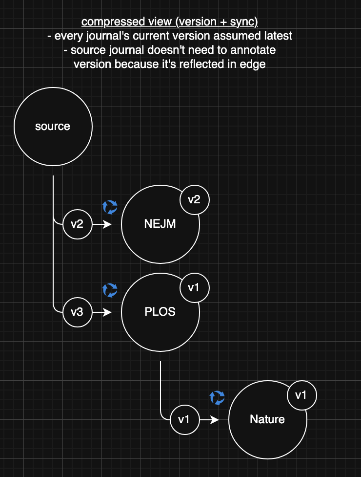
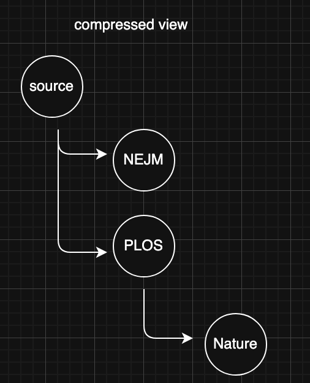
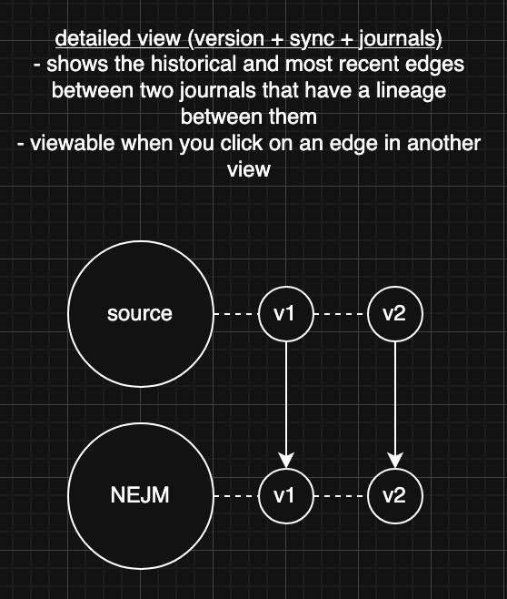
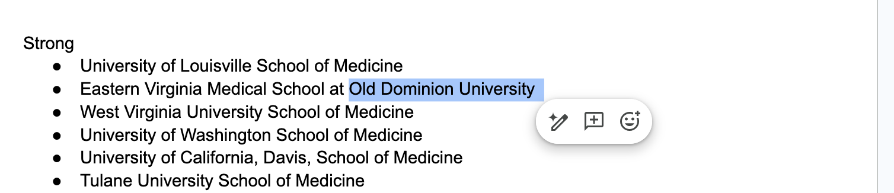
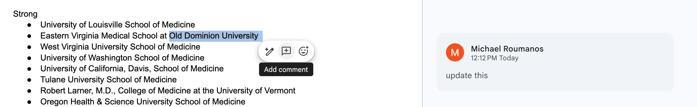
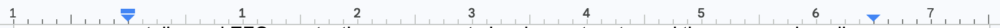
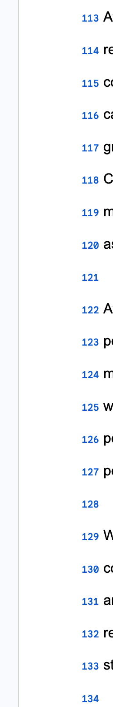

# 05 — Features & Acceptance Criteria

Each feature lists the intent and concrete, checkable acceptance criteria. "AC"
items are the bar for "done."

## A. Manuscript lifecycle & storage

Intent: a manuscript is a folder the user owns.
- AC: New manuscript prompts a folder picker; `manuscript.json`, `figures/`,
  `data/` are created in the chosen folder.
- AC: Access persists across launches via security-scoped bookmark.
- AC: Window title shows the manuscript name at all times.
- AC: Older saved manuscripts still open (backward-compatible decoding).
- AC: **Overview is the manuscript dashboard**: source statistics (words,
  sections, figures, tables, references) **plus one row per journal cut** —
  head version, its content's word/asset counts, and its live checks verdict
  (`12/14` with the pass/attention color).

## B. Source content authoring

Intent: most time is spent here; it must be excellent and AI-optional.
- Components: Authors, Abstract, Keywords, body Sections (add/reorder/rename/
  delete; custom types allowed), Figures, Tables, Bibliography, Letter to Editor.
- AC: **Authors + institution registry.** "Add Institution" sits next to
  "Add Author" (same pane); institutions are named inline and authors
  affiliate by checking registry references in the editor — **required**:
  an author with no institution reference is flagged (orange warning in the
  row and editor). Deleting an institution strips its references. Authors
  **drag-to-reorder** (offsets applied against the sorted list). Exports
  resolve affiliation lines from the registry (legacy free-text still
  honored).
- AC (implemented): **Categorized author search** (Aug 2026). A search bar
  at the **top of the Authors pane** (shared chrome: `SearchDropdownBar`, a
  floating measured-height dropdown capped at 40% of screen). Sections:
  **"Saved (N)"** text-matches existing authors — clicking one just opens
  its card; **"ORCID (N)"** lists top-20 public-API hits (name in either
  order, or a full iD) each with a **+** that adds the autofilled author
  (names, iD, public email) and references the hit's primary institution —
  matched case-insensitively against the registry, **created there only if
  missing** (`OrcidService`, `addAuthor(from:)`). Query gotcha: the search
  index field is `family-name` (singular); the response key is
  `family-names`.
- AC (implemented): **Zotero link locks** (Aug 2026). Zotero-imported
  entries carry a per-entry **lock** in the list, every state with hover
  info: grey open lock = unlocked, a normal editable reference; green lock
  = locked and **matched live** in the local library; orange = locked but
  no match; dim = Zotero unreachable. Matching ladder: **key > DOI >
  title+authors > URL** (`zoteroMatch`), and found matches are **never
  written back** — the link stays dynamic (`BibEntry.zoteroLocked`;
  read-only in the editor follows the lock, not the key). **Refresh from
  Zotero** (Add Reference menu) re-pulls every green entry's fields from
  the library **and its citeproc-formatted bibliography entry** in the pane
  journal's CSL style (org authors, italics, access dates —
  `formattedBibliography(style:)`, styles auto-fetched by Zotero;
  `BibEntry.formattedReference/-Style`). Refresh caches **every supported style**
  (`BibEntry.formatted[cslID]`), so the References item's **citation-style
  picker in the Bibliography pane's settings gear** ("Journal style" default = the journal's
  required style via `CitationStyle.cslID`, or APA/AMA/Vancouver/MLA/
  Chicago/Harvard explicitly, `ExportItem.citationStyle`) works offline.
  Exports resolve each entry **override > cached style > generic
  assembly** (`RefEngine.referenceText`): the attributed References list
  renders <i> runs as real italics; LaTeX and tooltips use stripped text.
  Each reference carries a **"Custom export text" toggle** (off by
  default, editable even while Zotero-locked; seeds from the current
  rendering) whose text exports verbatim in every style and is never
  touched by Refresh. Orange entries keep their saved
  snapshot, which always cites/exports fine — collaborators without the source library just see
  orange locks (or unlock to edit).
- AC (implemented): **Categorized bibliography search** (Aug 2026, same
  pattern + the same query doubles as the list filter). Sections by input
  shape: **"Saved (N)"** matches existing entries (click opens);
  **"Zotero (N)"** searches the local Zotero library, + adds via the
  existing `bibEntry(from:)` mapping (zoteroKey dedupe applies); a **DOI**
  (bare, doi:, or doi.org URL) resolves **full metadata** via doi.org CSL
  JSON content negotiation — title, authors, journal, year, volume/issue/
  pages, publisher, type (closes issue #9; `ReferenceLookupService`); a web
  **URL** fetches the page `<title>` to seed a website entry. The
  Add-by-URL sheet runs the same lookups, falling back to a bare DOI/URL
  entry when offline.
- AC (implemented): **Author credentials** (Aug 2026). One free-form
  Credentials line ("MD, PhD, Prof.") at the end of the Name section — it
  replaced a separate honorific field plus a title-tag row, two fields for
  one idea. Text stores in `degrees`; a legacy `titles` tag list still reads
  (joined) and bylines resolve through `effectiveTitles` either way. **Authors-item byline options** (Aug 2026;
  edited from the Authors pane's settings gear since the export-page
  cleanup): a **delimiter picker** (comma / semicolon / newline — separates authors
  AND the affiliation lines, `ExportItem.authorDelimiter`) and a
  **linkage-marker picker** (superscript numbers default, † crosses,
  ‡ double crosses, or none — `affiliationMarker`); markers render via the
  materialized raise (small font + baselineOffset) so all writers show
  true superscripts, and LaTeX uses \textsuperscript. Institutions carry
  optional **city/state/country** (`Institution.city/-state/-country`,
  edited in the institution form) and export as
  "<institute> <city>, <state> <country>" (`displayLine`). **Delimiter pickers use the "a; b"
  sample notation everywhere** (Authors item and the [[part]] token menu
  alike). A **"+ corr" toggle** (default on) annotates the corresponding
  author with a raised * — styled like an institution marker — plus a
  "* Corresponding author — 
" footnote line under the
  affiliations ([[authors]] tokens render the same). The
  same gear carries a compact **"+ cred" toggle
  button** (`ExportItem.showAuthorTitles`, default on = the historical
  output) switching the byline between plain names and names + credentials,
  in the attributed and LaTeX writers alike.
  ("Credentials", not "titles" — the item is "Title & Authors", and a second
  "title" would collide.) The editor's Contact section is email + ORCID
  only; the postal `address` field remains in the model for old files but is
  no longer edited.
- AC: Each list view (Authors/Figures/Tables/Bibliography/Data) auto-selects the
  first item; an empty state offers a centered "Add …" action (no broken
  half-empty split).
- AC: Each added item has a clear inline delete affordance.
- AC: Prose editors are rich text (see §G). Word counts update live.
- AC: Letter to Editor has a three-slot letterhead (left / center / right —
  each an optional uploaded image plus freeform text, laid out like a real
  letterhead in editor and exports), body, and a **drawn-only
  signature** (drawable pad with Reset — no typed signature box); preview
  comes from the pane header's export-preview button (the real pipeline —
  the bespoke approximation panel was retired, Aug 2026). Slot images accept PNG/JPEG/TIFF/HEIC/**SVG** (SVG bytes
  are kept as vectors).
- AC (implemented): **Section parts** (Aug 2026). The "/" picker lists just the
  referencable SECTIONS (`PartEngine.topLevel` — Title, Authors,
  Keywords, Abstract; Title's subsections: running title / project name;
  keywords join by the token's delimiter;
  `part://t/<path>?d=&m=` links, curly-braces icon). The editor shows the
  literal `[[path]]` marker — format it like prose, and the export
  expansion (last styling pass) **inherits the token's attributes**;
  markers use the materialized raise. **Clicking a token** opens its menu:
  delimiter (space / semicolon / newline), linkage markers on `authors`
  (superscript / crosses / double crosses / none), and **Subsection** —
  picking one changes the words in the brackets (`[[authors]]` →
  `[[authors.corresponding_author]]`), and the new token has its own
  selections when clicked (children per `PartEngine.children(of:)`:
  names / institutes / corresponding_author, then first_name / last_name
  / email / details; "⬑" climbs back up). LaTeX expands
  plain `[[path]]` markers with defaults. The corresponding-author toggle
  reveals a **Details** free-text box (`Author.correspondingDetails`)
  referencable as `[[authors.corresponding_author.details]]`. The
  Authors-item delimiter picker shows words (semicolon default / comma /
  newline).
- AC: The letter body's "/" offers **Date** and **Signature** as live
  **references** — ⟦Date⟧/⟦Signature⟧ marker tokens (letter:// links in the
  editor) that resolve in preview and every export: today's date at render
  time, and the drawn signature image. With no ⟦Signature⟧ placed, the
  drawing still closes the letter; LaTeX resolves the date and drops the
  signature marker (source-only output).
- AC: **Title pane** — first item in Content; edits the journal-facing
  **article title** (+ running title) per cut, so it can differ journal to
  journal. Exports print it, falling back to the **project name**
  (`Manuscript.title`), which names the folder/Welcome entry.
- AC: **The app always launches on the Welcome screen** (the project
  manager) — nothing auto-opens. The editing window's title bar carries a
  **"Manuscripts ›" breadcrumb** before the manuscript name — clicking it
  saves + closes back to the manager (same path as File → Manage
  Manuscripts…), and manager rows with a configured remote repository wear
  a **cloud badge** (hover shows owner/name), so the recency-sorted list
  doubles as "recently remote-connected projects" (issue #20). The Welcome
  branding shows the real app icon (the ME monogram asset). Rows open on **double-click or the pencil
  button**; the orange **⊖ removes the entry from recent memory** (files
  stay); the red **trash deletes** (folder → Trash, confirmed); right-click
  adds Rename…/Reveal in Finder. **File → Manage Manuscripts…** saves +
  closes the current manuscript and returns to Welcome — so the project
  you're loaded on can never be trashed.
- AC: The fixed Figures/Tables/Bibliography/Letter panes support right-click
  **Rename…** and **Remove from Sidebar** (restore from the dimmed "Show …"
  rows at the bottom of the Content list).
- AC: **Custom sections with per-journal activation.** Add sections from an
  inline "＋ Add Section" row at the **bottom of the section list** (not a toolbar
  button); titles are kept **unique**. A new section is **created for every
  journal** (shared structure). Each journal can **deactivate** a section it
  doesn't use via the eye toggle in that section's pane header — deactivated ⇒
  **uneditable and excluded from Checks and Export, with content preserved**
  (e.g. keep a Disclosure section active only for NEJM); reactivating restores
  the text exactly as it was. Renaming, reordering, and deleting
  apply everywhere; content is per-journal. A section absent from an older cut
  shows a clean "Not included in this version" state (no broken rendering).

## C. Data repository + SQL binding

Intent: data lives once; figures/tables reference it; cuts convert only SQL.
- AC: Import CSV → stored as SQLite in `data/`; import images → copied to `data/`.
- AC: A CSV asset has a SQL editor; results show in a grid; errors show inline.
- AC: **Result grids use the native SwiftUI `Table`** (shared `QueryResultTable`
  component): resizable columns, alternating rows, single-line truncation with
  the full value on hover — never a hand-rolled per-cell-border grid. Results
  cap at 500 rendered rows with an honest "showing first N" footer.
- AC: Figures can reference a CSV (chart: line/bar/histogram via SQL) **or** an
  image; tables can reference a CSV (SQL → table). Reference = `dataAssetID` + SQL.
- AC: **Data-linked figures render live in the figure editor**: the chart
  (bar/line, or a real binned histogram) redraws as the SQL or chart type
  changes (SQL debounced ~0.4 s). Column mapping: first SELECT column = X,
  second = Y.
- AC: **Data-linked tables preview live**: when a table has a data source, the
  editor's content pane shows the query's result grid (same component as Data)
  instead of the Markdown editor, updating as the SQL changes.
- AC: **Figure image adjustments are non-destructive**: crop, resize (10–100%),
  and **black & white** each apply to the figure's rendering (previews,
  thumbnails, export) only — the original image in Data never changes. The
  crop editor stays **inside its preview box** (clipped) and uses **one
  unified gesture** — drag near a corner resizes, drag inside moves.
- AC (implemented, Aug 2026): **One Data picker per figure** — a single
  "From Data library" list spanning CSVs and images; the fields below
  follow the picked asset's TYPE (CSV → chart type/colors/SQL, image →
  size/crop/B&W). The Data section comes FIRST in figure and table
  editors. Chart **series come only from an exactly-3-column SELECT**
  (wider results are table-shaped; guessing a series once produced more
  categories than palette colors, which renders an empty chart — colors
  now also cycle when categories exceed the palette). **Alt text is not
  edited** (print manuscripts; the field survives for old files).
- AC (implemented, Aug 2026): **Arrangement**. A figure/table exports as
  three SORTABLE pieces — the **title** ("Table 2. Effects…", the index
  folds in), the **asset** (image / table grid), and the **caption** —
  reordered by DRAGGING their handles in the editor's Arrangement section
  (`arrangement: [String]?`; defaults reproduce the classic output:
  figures image→title→caption, tables title→table→caption). Title and
  caption carry a **print toggle, bold/italic/underline, and
  left/center/right alignment** (`CaptionPartStyle.align`); the table
  piece carries its **page-width % as a slider (25–100)** and alignment
  (`tableWidthPercent`/`tableAlign`), the image piece its alignment
  (`imageAlign`; size stays with the image fields). The title row reads
  "Title" + its editable text (no number field — the index is
  reference-ordered). The **caption is a rich box** (`captionText:
  RichText`, plain `caption` mirrored): character-level bold/italic/
  underline and alignment via a visible mini toolbar AND the standard
  keys (⌘B/⌘I/⌘U, ⌘E center), which the caption text view intercepts
  itself (`performKeyEquivalent`) — the app has no Format menu to route
  them, and interception keeps ⌘B away from the grid's scene-wide
  shortcuts while a caption is focused. Rendered through the export at
  the caption look (`richCaptionBlock`). Table **footnotes are
  no longer edited per table** (a manuscript-wide footnote system is the
  intended replacement; stored footnotes still export as "Note." lines).
- AC (implemented, Aug 2026): **Manual tables are a GRID, not Markdown**,
  built on AppKit — ONE `NSView` inside an `NSScrollView`
  (`SpreadsheetGrid`; see gotcha 15 for why SwiftUI couldn't hold it, and
  why the header can't be a separate pinned view). The grid **fills its
  pane** (columns share the visible width until dragged); the **header
  row and a numbered row rail stay frozen** at the viewport's edges,
  drawn at the current scroll offset by the same view that owns hit
  testing. **Row numbers are an editing aid only — never part of `cells`,
  never exported.** Clicking a header selects the WHOLE column and
  dragging it reorders; clicking a row number selects the whole row and
  dragging reorders; selections extend into the header row (drag up or
  ⇧↑) so headers can be styled. Columns resize by dragging a header
  boundary, hovering the **bottom edge adds a row / the right edge adds a
  column**, double-clicking a header renames it, and right-click offers
  add/delete for the row or column under the pointer. Editing and navigation are
  **click selects, double-click (or Return, or just typing) edits, and
  drag / ⇧-click / ⇧-arrows extend the selection** as a rectangle; Tab
  and ⇧Tab move across, ↑/↓ move down and up, ⌫ clears the selected
  cells, and ⌘V pastes a spreadsheet block (TSV) from the anchor,
  growing the grid as needed. Only visible rows draw, so a long result
  costs the same as a screenful;
  the toolbar — and **⌘B/⌘I/⌘U/⌘E** — styles every selected cell (bold /
  italic / underline / **highlight via 5 inline color swatches** / alignment;
  `TableCell.highlightColor`). **Data-linked tables get the SAME grid in
  styling-only mode** (no gutters/add bars/editing — the data owns shape
  and text): `cells` persists a style OVERLAY aligned to the query result
  (row 0 = header), merged at render so what you style is what prints
  (`ManuscriptTable.styledGrid`); Disconnect-from-Data keeps the overlay
  styles on the copied cells. **Hovering a cell** reveals its row's and
  column's **grab handle (drag to reorder, header pinned)** and **"−"
  (remove)** in the gutters — the "−" sits FARTHER from the table than
  the handle (no accidental deletes), the controls stay put for the last
  hovered cell (cleared only when the cursor leaves the grid), and while
  dragging they anchor at the START index — moving them with the row
  shifted the gesture's coordinate space and made the row hunt; thin bars at the **bottom/right illuminate a
  "+"** to add a row/column. Row 0 = header;
  `ManuscriptTable.cells: [[TableCell]]` is the source of truth, the
  pipe-Markdown `content` stays as a plain mirror, and legacy content
  parses into the grid on first edit. Both export writers render the
  per-cell styles (drawn PDF grid and NSTextTable alike).
  A data-linked table can **Disconnect from Data** (destructive-confirmed):
  the current query result copies into the manual grid and the link is
  removed — one-way. **Table width is a share of the SECTION's text
  column**: the width % (25–100, default 100) measures against the
  margins in force where the table sits — blocks receive the running
  section geometry, not the document's static format, so a table in a
  1.5″ section spans exactly that section's column (verified at the pixel
  level: 108→503 for 100%, 108→305 for 50%). **Autofit** (Export
  Formatting, on by default) decides how that width is DIVIDED, never
  whether the table fills it. A column's natural width is its widest DATA
  cell (measured from row N down; default 2, no rows are ever dropped)
  and its header's **longest word** — a header may wrap between words, a
  number may not. When the naturals still overflow, autofit **shrinks the
  cell font** (to 62% at most) before it will wrap anything, then
  fair-share caps what remains. Autofit OFF divides the same width by the
  ratios of the **drag-adjustable column widths**
  (`ManuscriptTable.columnWidths`); **dragging a column width switches
  autofit off automatically**, since a hand-set width and auto-sizing are
  contradictory (the drags persisted but the export kept computing its
  own widths, so nothing appeared to happen). A stored-width count that
  no longer matches the query's columns is trimmed or padded rather than
  discarded. Multi-cell styling writes ONE snapshot (per-cell binding writes
  re-read stale state — only the last cell survived). The **preview
  always renders the PDF construction** — CoreText ignores NSTextTable,
  so a DOCX/RTF document's tables previewed as newline soup. Figure/table
  **titles print as the title text alone** (no "Table N." prefix).
- AC (implemented, Aug 2026): **Data uploads are renameable** (CSV and
  image assets — the header name edits in place; default = file name).
  CSV imports **keep the original CSV** beside the SQLite store, enabling
  **"data starts at row N"** (default 2; header = the row above; earlier
  rows are preamble and skipped) — changing it rebuilds the table
  (`DataService.refitCSV`; hidden for pre-Aug-2026 imports whose CSV
  wasn't kept). The **SQL box drags taller** by its grabber.
- AC: Changing journals/cuts never alters underlying data — only the SQL/format.
- AC: Each data asset has a delete affordance.

## D. Journals, views, and requirements

Intent: a journal is what you adapt *for*; it bundles content **requirements** and
an output-format **view** (both required). The Source is the root journal.
- AC: Add a journal from a **preset** (supplies requirements + view) or custom.
  Every journal has `JournalRequirements` **and** a `ViewConfig`.
- AC: The **Source** journal exists from creation with **default (empty)
  requirements** and a **default view**.
- AC: A journal's default view is derived from its requirements
  (`ViewConfig.from(requirements:)`): sections, export format, separate-figures
  doc. Users can also create/manage **custom views** (Preferences → Views).
- AC: **View = output format only** (documents, per-section title/font/spacing,
  line numbering, export format). It is NOT content requirements and NOT the
  user's global editor preferences. Keep these three separate everywhere.
- AC: Target journals carry submission config; Source does not submit.

### D2. Submission profiles (article types)

Intent: one journal accepts different **article types** (Original Article, Review,
Case Report, …), each with its own rules and layout.
- AC: A journal has **one or more submission profiles**. A profile bundles, for a
  named article type: its **checks** (`JournalRequirements`) **and** its **export
  outline** (a view — sections, order, per-section format; see M). Checks and
  export travel together per profile.
- AC: A journal may include a **Custom** profile the user defines.
- AC: The active profile is selectable per version; Checks and Export both use the
  **active profile** so what's verified matches what's exported.
- MODEL: `Journal.profiles: [SubmissionProfile]` where
  `SubmissionProfile { articleType, requirements, outlineViewConfigID }`. This
  supersedes the single requirements + view per journal and ties into the pending
  migration (see [`09-roadmap.md`](09-roadmap.md)). The Source journal has one
  default profile with empty requirements + a default outline.

## E. Versioning (stamping — Source and journals alike)

Intent: every journal **and the Source** has its own save-point history; the
working state is always "latest", and **stamping** freezes it as a numbered
version.
- AC: The Versions pane is per-tab and renders a **horizontal table**, newest
  first: Version ("latest" for the working row — never a number) · Stamped
  (date/time) · From → To · By (signer, with the signature badge).
- AC: **Stamp Version** freezes the current content as `vN` and moves "latest"
  to a new row; disabled when nothing changed since the last stamp. Stamps are
  signed with the user's identity key (`stampedByKey`/`stampSignature`).
- AC: **Roll Back…** on a selected prior version restores it and **drops the
  versions after it** (confirmed with the concrete count; refused with an
  explanation when another journal's cut hangs from a dropped version).
- AC: **Source stamps** (`sourceStamp == true`) chain the live manuscript:
  rolling Source back restores content fields from the stamp and keeps
  journals/notes/data intact.
- AC: When a journal has unsaved edits, show a prominent **unsaved-changes
  banner** that triggers Save when clicked.

## F. Lineage, cuts, sync & rollback

Intent: derivation is tracked as edges between journal *versions*; updates
propagate by explicit, individual fast-forwards.
- AC: The **Journals** panel shows a lineage tree rooted at **Source** (unlimited
  depth).
- AC: Creating a journal from a parent journal's current version makes the child
  at `v1` and an edge `parent@vX → child@v1`.
- AC: Editing a parent forward (new versions) does **not** alter existing edges.
- AC: **Sync** re-derives one child from its parent's newest **stamped**
  version. Every edge A→B is **checksum-verified** first (SHA-256 over the
  content with volatile metadata zeroed): identical A/B latest contents
  short-circuit to a green "already in sync" banner (no version churn), and
  an upstream whose latest differs from its own last stamp **refuses to
  sync** with a red banner directing the user to stamp A in its Versions tab
  first — lineage edges always hang from frozen versions. **Never recursive.**
- AC: Journal rows show **"Last synced X · Last edited Y"** (Source: last
  edited only) instead of persistent "up to date" badges; the blue "upstream
  has moved — fast-forward available" hint remains. The lineage renders as
  **one connected container** — children as indented, same-height rows under
  their parent (dropdown style), each prefixed with **curved branch arrows
  (↳), one per nesting level** — and each journal shows its **icon** (an SF
  Symbol configured in the app-settings Journals library; "?" when unset).
- AC: **Title-bar chrome.** The center of the window toolbar is a reusable
  **notification banner** slot (`ManuscriptStore.showBanner` — green success
  / red failure, auto-dismissing): all sync messages, save confirmations,
  and remote push/pull results surface there (no inline banners in the Sync
  pane; no blocking remote-error alert). **Adaptive Remote controls**
  (Aug 2026): the configured repository is verified on manuscript load and
  after repo edits (one commits fetch proves the repo exists and its content
  branch loads; offline keeps the previous state). A verified repo shows
  **Save | Load**; a missing or blank one swaps them for **Create**, which
  creates + pushes — using the entered name, else
  `manuscript-editor-<title-slug>-<id8>` (`suggestedRepoName`). The
  repository entry is **owner/name only** — the branch layout (main /
  source / journal-*) is fixed, nothing to type. The top-right shows the **save
  status**: last local save time and last remote push ("N/A" when no backend
  is configured). **Save (Local)** always writes to disk and banners;
  **Save (Remote)** banners its async result.
  Example: `Source@v2 → NEJM@v1`; Source edited to `v3`; Sync NEJM ⇒ `NEJM@v2` and
  edge `Source@v3 → NEJM@v2`.
- AC: **Rollback** restores the prior edge and **soft-archives** the newer
  versions it produced (hidden but recoverable — not hard-deleted). Example:
  `Source@v3 → NEJM@v2` with prior `Source@v2 → NEJM@v1` ⇒ rollback re-activates
  `Source@v2 → NEJM@v1` and archives `Source@v3`, `NEJM@v2`.
- AC: **Phase I** — cut/sync creates the journal version and lineage edge and
  **seeds the child from the parent snapshot**; the user reconciles content
  **manually**. **Phase II** — the configured **AI service** auto-derives the
  child content toward the child's requirements.
- AC (implemented): **Sync pane** — under the Manuscript section — carries the
  three flow functions: **Saving** (Save Local / Save Remote / Load from
  Remote with last-saved/last-synced timestamps), **Syncing** (plain per-edge Sync buttons — checksum-prechecked as above,
  and the confirmation states whether a connected AI may modify the copy —
  on a **contiguous** nested lineage tree — child
  cards attached beneath their upstream, tabbed left, right edges aligned),
  and **Add Journal** (from = Source or any journal; to = a profile found by
  **searching the saved journal library** — the same search pattern as the
  Authors/Bibliography bars, app-saved profiles only, no web query (that can
  come later) — or an unchanged **custom name** field; creates v1 "Created"
  + the edge,
  and the journal's tab appears automatically). **Journals carry an article
  type** (`Journal.articleType`, optional): one journal ships once per
  submission format as separate library entries — e.g. AJPH "Research
  Article" (3500 words / 180-word structured abstract / 4 tables+figures
  combined / 35 refs) and AJPH "Research Brief" (1200 words / 1 table OR
  figure / 12 refs), each with a checklist distilled from the published
  author instructions.
  **Source requirements vs checks** (Aug 2026). The two are different
  things and the pane says so: **source requirements** are the journal's
  own instructions — a link to its author-instructions page plus a
  distilled, free-text summary the user edits directly — while **checks**
  are what the app actually enforces. The typed `JournalRequirements`
  fields survive only as the export's seed (font, spacing, line numbers)
  and are reached through a secondary "Requirements…" button.
  **Three configuration files per journal, in one folder** (Aug 2026):
  `requirements.json` (the journal's instructions as **bullets** plus the
  link they came from), `checks.json` (the rules the app evaluates), and
  `structure.json` (the sections a submission is expected to have). They
  are split so a difference shows WHICH half moved.
  **Structure lists only the CONFIGURABLE sections.** Title, authors,
  abstract, keywords, figures, tables, bibliography, and the cover letter
  come with every manuscript whatever the journal, so a structure file has
  nothing to say about them — it names the prose sections, their order, and
  which are required. A structure file that also listed the fixed parts
  (briefly, Aug 2026) still decodes: those entries are dropped on read and
  never written back, which keeps fingerprints stable so no phantom
  "structure differs" warning appears. All three share an
  `id` — the profile's **GUID**, which is the identity: one journal can
  carry several profiles (article types), a rename must not orphan a
  manuscript's copy, and the GUID is what maps a journal to a library
  entry (`Journal.profileID`).
  **Three places hold them**, in order of authority for a manuscript:
  **bundled** (`ManuscriptEditor/JournalProfiles/<slug>/`, shipped and
  browsable on GitHub) → **library**
  (`~/Library/Application Support/ManuscriptEditor/JournalLibrary/<slug>/`,
  seeded from bundled on first run, then the user's) → **manuscript**
  (`journals/<slug>/`, written on every profile edit so it travels locally
  and in the remote). The manuscript's copy always wins for evaluation.
  **Drift is shown, not resolved silently**: `JournalProfileLibrary.status`
  compares the manuscript's copy against the library **per part**, by
  content fingerprint (SHA-256 over canonical JSON with ids and timestamps
  stripped — `CheckRule` mints UUIDs on decode, so value equality would
  report a file as different from itself). Each part that differs gets a
  **yellow warning** on its row in the Checks pane.
  **Review before adding** (Aug 2026): Add Journal shows the chosen
  journal's profile inline — `JournalProfileReview`, a read-only segmented
  view of its requirements, structure, and checks — so the decision is made
  with the rules in view. It is read-only on purpose: editing there would
  beg the question of which copy was being changed. The added journal
  adopts that profile before its view is generated, so its outline follows
  the structure file and its Checks pane is populated the moment its tab
  opens.
  **An unedited journal TRACKS the library.** When `configOrigin` is not
  `.manuscript`, opening re-seeds it whenever the library's copy has moved
  on, so shipped corrections reach existing manuscripts. The first local
  edit sets `.manuscript` and the journal keeps its own copy from then on —
  except for a structure it never had, which is filled in rather than left
  empty.
  **A failing check is shown where the writing is** (Aug 2026): the pane's
  header carries a red **button beside the gear** (`CheckFailureButton`)
  naming the first failing check — the TITLE only, since a header has room
  for a name but not an explanation — with a circled count when more than
  one covers that pane, and the measurements ("References: 36") plus any
  **Fix** in a popover on click. It lives in the control cluster rather than
  as a band across the pane so it cannot cross the editor's gutter rule or
  push the text down. The sidebar badge carries the **number** of failing
  checks rather than an exclamation mark, which only said "some". Both are
  derived from `ChecklistService.scopeFailures`, so both vanish the moment
  the content passes. The badge now also renders on the FIXED panes —
  figures, tables, bibliography, letter — which previously had no badge at
  all, so a blown combined figure+table cap or reference limit was invisible
  outside Checks.
  `CheckRule.scopeKeys` is deduplicated: a rule with four conditions over the
  abstract is ONE failure there, and the count has to say one.
  **MODIFIED** is stated, not merely implied: the Checks header shows a
  MODIFIED badge and each drifted row is labelled, so a manuscript opened
  from someone else immediately reads as carrying rules that are not yours.
  **Save to Library always offers two outcomes** — overwrite the library
  entry, or **branch**: save a new profile of your own with a new GUID that
  records where it came from (`SaveProfileToLibrarySheet`,
  `ManuscriptStore.branchProfileToLibrary`).
  **Lineage is a CHAIN** (`JournalProfile.lineage`, nearest ancestor first,
  carried on `Journal.profileLineage`). Share a manuscript whose profile was
  branched and the next person's library holds the ancestor, so
  `status(of:)` walks the chain and reports `.derived` — MODIFIED against
  *their* copy, with the same two choices — instead of an unexplained
  stranger. Walking the whole chain (not one hop) means a branch OF a branch
  still resolves for someone who only holds the root. Overwriting an ancestor
  clears the lineage, since the branch has become the thing it descended
  from. The fingerprint ignores `journal`, `articleType`, and the lineage
  itself: renaming a branched profile is not a change to its requirements.
  **Save to Library covers these cases: the GUID is in the library
  but the content differs → *Update Library*; the GUID is unknown but a
  profile with the same NAME exists → *Replace in Library…*, which confirms
  first and links the manuscript to the library's GUID (or adds a separate
  profile); neither GUID nor name is known → *Add to Library*, a net add.
  When everything matches, the button is replaced by "Matches your
  library".
  The Checks pane **links to whichever copy is in force**, so "where did
  this rule come from?" is one click.
  **Every journal ships a real profile** (Aug 2026): all 17 presets have a
  hand-written `JournalProfiles/<slug>.json` whose **source requirements**
  are a distilled summary plus a link to that journal's author-instruction
  page, and whose **checks** encode those requirements — technical and
  manual alike. A journal seeds itself from the bundled profile when it
  has none (`ManuscriptStore.seedProfileIfNeeded`, run on open and on add),
  so existing manuscripts pick them up with no migration.
  **The checklist shows only profile checks**: everything displayed is a
  rule in `Journal.checkRules`, therefore everything is editable in
  **Edit Checks…**. (Journals saved before profiles existed still fall
  back to their legacy `customRules` so nothing vanishes.)
  **The structure file is checked too**: the `STRUCTURE` metric compares
  the manuscript's active, non-empty sections against the sections marked
  required in `structure.json`, and `ViewConfig.from(journal:)` seeds a new
  cut's outline from it — which is how a journal-named section
  ("Public Health Implications") reaches a cut at all, since the typed
  `requiredSections` can only express the IMRAD enum.
  **Configurable checks** (Aug 2026): a journal carries
  **rules** (`Journal.checkRules`) in a small vocabulary:
  **LENGTH (words|characters) · COUNT · EXISTS · CONTAINS**, plus
  **STRUCTURE** (the structure file) and the export-format metrics
  **FONT_SIZE · LINE_SPACING · LINE_NUMBERS** (which read the journal's
  export configuration and carry the typography **Fix**) — all of those
  ignore the scope picker, which the editor hides for them — compared with
  **≤ ≥ = ≠**, over a **scope** (title, subtitle, abstract, keywords,
  authors, the whole body, one named section, figures, tables, references,
  cover letter) — **sections appear flat in that same list, and several
  scopes can be selected at once, and several are SUMMED**: LENGTH over
  Introduction + Methods + Results + Discussion adds their word counts, which
  is how a journal's "body" limit is actually defined — the opaque
  `body` scope counts every active section, front matter included (measured
  on a real manuscript: 2,391 summed vs 2,710 for all sections). The failure
  detail shows the addition — "Introduction 414 + Methods 837 + Results 696 +
  Discussion 444 = 2,391 words" — so an over-limit body says which part is
  big. COUNT sums likewise; EXISTS/CONTAINS require each scope.
  A multi-scope condition **labels itself "Introduction (4)"** — the first
  scope and how many there are; naming every one swamped the rule it belonged
  to. The scope menu ticks what is already chosen, so a multi-select set is
  readable without opening anything.
  Each scope is measured on its own and the results added, rather than
  concatenated and measured once: concatenating inserted a separator per join
  and inflated character counts by one per extra scope.
  The **subsection** picker is withdrawn (Aug 2026) — parsed run-in headings
  were more confusing than useful in the row. `CheckCondition.subsections`
  stays in the model so existing rules keep evaluating, but nothing offers
  it.
  **Manual checks are just checks**: a rule with no conditions renders as
  a checkbox in the same list and the same editor.
  Conditions join with **ALL (and)** or **ANY (or)**, so
  "Methods exists AND ≤ 400 words" and "either a Limitations or a
  Discussion section" both express directly. The editor lives behind
  **Checks → Edit Checks…**, so it surfaces only for people refining a
  profile; a rule can be disabled without deleting it and can carry
  guidance shown on failure. **Sections show their own status**: every
  condition names a scope, so a failing rule marks the panes it covers
  (`ChecklistService.scopeStatus`) and the sidebar puts a red marker on
  that section — an exceeded word limit is visible where the writing is,
  not only in Checks.
  **Checks split technical from manual** (Aug 2026) — both now expressed
  as profile rules:
  measurable rules are evaluated
  automatically — cover-letter word cap, combined tables+figures cap,
  required section *titles* ("Public Health Implications": active +
  non-empty), structured-abstract headings present in the text, export
  spacing ≥ / font size = / line numbers on (read from the journal's
  export config) — while rules the app can't measure
  render as **manual checkboxes**
  (neutral until ticked; ticks persist per journal in
  `Journal.manualChecksDone`; `ChecklistResult.manual`). The Checks header
  links to the journal's **author instructions** (`submissionURL`, seeded
  from the preset). Compound rules
  are split so each half lands on its side (cover letter ≤150 words =
  technical; "addresses what the paper adds…" = manual, in
  `JournalPresets.ajphSharedRules`). Display everywhere uses
  `displayName` ("Name — Type"); library seeding/dedupe keys on
  name+type and retires stale untyped entries when typed ones ship.
  Syncing shows a
  **warning dialog** ("overwrites what currently exists in the journal's
  working head; previous versions remain in history") before creating the new
  version + edge via `ManuscriptStore.syncJournal`.
  Because syncs are one edge and never recursive, the status must not
  overstate freshness for chains through another journal: when the upstream
  journal is itself behind *its* upstream, the card warns "sync it first"
  (orange) instead of a green "up to date"; when up to date through a journal
  whose root is the live Source, the card dates the content the upstream
  carries and the warning dialog names the exact snapshot that will be copied
  ("Nature does not pull from Source directly — sync NEJM first, then
  Nature").
- AC (implemented): **Title and byline are fully decoupled.** The title
  component prints title, subtitle, and running title — never the authors.
  The byline is its own `.authors` item, added and removed like any other:
  nothing re-inserts it, so a Blind Manuscript document stays blind. (A first
  cut of this re-added `.authors` on every read to protect pre-split configs
  from losing their byline; that made the item impossible to delete, which is
  worse than the problem it solved. An outline that predates the split shows
  no byline until an Authors item is added by hand.)
- AC (implemented): **The byline can be split, and keeps its indexing.** The
  Authors item prints **Names + institutions** (default), **Names only**, or
  **Institutions only** (`ExportItem.authorParts`), so a journal wanting the
  byline on the title page and the affiliation list at the foot — or on
  another page — is expressible. The affiliation index is computed the same
  way whichever half prints, so names keep their superscripts when the list
  lives elsewhere: verified "Ada Lovelace¹*; Alan Turing²; Grace Hopper¹˒³"
  renders identically with and without the list beside it.
  The list itself lays out as the raised marker (default) or as a numbered
  list — **"1. Analytical Institute"** — via
  `ExportItem.affiliationListStyle`.
- AC (implemented): **An export document can be an UPLOADED FILE.** "Upload
  File…" beside Add Document takes a file of any type, copies it into the
  manuscript's `attachments/` folder (so it travels with the manuscript, and
  with its remote), and adds it to the outline as a passthrough document:
  no items, no typography, no file-type picker — it is copied into the
  package byte for byte (verified by SHA-256). This is the escape hatch for
  what the app cannot format — a signed form, a spreadsheet, a figure
  prepared elsewhere. Removing the document deletes the stored copy.
  A **Preview** button opens it in **Quick Look** (`Services/QuickLook.swift`),
  which renders every type Finder can — PDF, Word, spreadsheets, images,
  plain text — and shows its own "no preview available" for the rest. That is
  deliberately the system's judgement rather than a list of supported types
  here, which would only drift.

- AC (implemented): **Page numbers sit beside line numbers** as a Section-row
  switch (`ExportItem.sectionPageNumbers`, `ExportDocumentFormat.pageNumbers`),
  inheriting down the outline the same way. They print centred in the bottom
  margin, and the count runs across the whole DOCUMENT — a section that turns
  numbering back on carries on from where the pages actually are, rather than
  restarting. LaTeX output emits `\pagestyle{empty}` when they are off, since
  it numbers by default.
- AC (implemented): **Line numbering restarts wherever it is broken.** Numbers
  are continuous only while consecutive sections all have them on; a section
  with numbering off breaks the run, and the next numbered stretch starts
  again at 1. Verified on a three-section document with the middle section
  off: pages read 1–2, 3–17, none, then 1–15 again, with page numbers 1,2,3,4
  throughout.
- AC (implemented): **A letterhead slot is an image OR text, never both.**
  Stacking a logo over a line of type in one corner is not what "left" or
  "right" means, so setting either replaces the other
  (`LetterHeaderSlot.setText` / `setImage`; the text well is hidden while an
  image is present, and the export prints whichever the slot holds). A slot
  saved when both could coexist keeps the image — the more deliberate of the
  two.

- AC (implemented): **A large table starts on the page it reaches, not the
  next one.** Table chunks are images, and an image cannot be split across a
  page, so a chunk cut to a FULL page could almost never fit under preceding
  content — the table bumped, leaving most of a page blank (measured: a
  Tables document whose first page ended at 27.8%). The paginator now feeds
  the layout back: when the next block is a drawn table that would bump while
  the current page still has real room, it asks that table to re-cut its
  first chunk to the space remaining (`ExportAttr.tableRechunk` →
  `TableRechunker`), then re-measures the page. Guards: single-column
  sections only, once per table, only when ≥2 inches and ≥25% of the page are
  free, only for tables that already span pages, and never a first chunk of
  fewer than two rows — below those thresholds a sliver under a repeated
  header reads worse than a gap. **The trade-off is explicit**: filling the
  gap costs one more chunk, so one more repeated header, and the same
  document may gain a page (that Tables file went 3 pages at 27.8/92.7/77.0%
  to 4 at 93.7/90.9/96.7% plus a caption tail).

- AC (implemented): **A component's settings reach every copy of it in the
  export.** An outline can carry the same component more than once — a
  journal wanting a separate title-page file has that section in the
  Manuscript document AND in its own "Title Page" document — and
  `ManuscriptStore.updateExportEntry` used to mutate the FIRST match and
  return. The pane's gear then read "heading off" while the export still
  printed one, because it rendered the copy that never got the change. It
  now applies the mutation to every matching item in every document. Export
  only READS these flags (the review there is read-only), so the component
  page stays the single writer and the two cannot drift apart.

- AC (implemented): **Versions pane is per-tab** — like Checks, it renders one
  pane per open comparison tab, each scoped to **that tab's journal** with no
  journal dropdown (the Source tab's pane covers custom cuts and explains that
  Source itself is always live). Each pane shows the journal's **linear**
  history (v1 → v2 …, newest = working head, leaf-only delete) and the
  **entire lineage diagram** — Source root plus every journal's chain, with
  the pane's journal **highlighted** and arrows connecting the exact versions
  (`LineageDiagram`, modeled on examples/lineage-detailed.png) — plus the
  selected version's details. Version numbers in these views are **per-journal
  ordinals** (`journalOrdinal`). The Versions pane no longer embeds
  requirements/checklists — the live checklist lives in **Checks** (§J);
  requirements editing lives in the Journals settings.
- NOTE: Two open design questions remain in [`02-domain-model.md`](02-domain-model.md)
  (multi-edge endpoints on one version; which version the tabs show by default) —
  resolve before implementing, don't guess.

### Lineage visualization (two views)

**Compressed view** — the default tree. Each journal node shows its **current
version** (e.g. NEJM v2, PLOS v1, Nature v1); the edge into it is labeled with the
**parent version** it derived from (Source v2, v3, …). The Source node needs no
version label because the edges carry it. A **sync icon** on an edge means a
fast-forward is available (the parent has advanced past the edge).

**Detailed view** — opened by clicking an edge between two journals; shows the
**historical and most-recent edges** between just those two journals (e.g.
`Source v1→NEJM v1`, then `Source v2→NEJM v2`), so the derivation history is
legible.

### Sync redesign (Aug 2026 — implemented)

- AC: Each journal row in Overview's lineage card has two sync buttons:
  **fast-backward** ⏪ (push this journal's latest UP to its upstream, full
  override) and **fast-forward** ⏩ (pull the upstream's latest DOWN, full
  override). The overridden side is stamped into its version history first,
  so both directions are recoverable. A checksum precheck short-circuits
  "already in sync"; a dirty upstream is auto-stamped rather than refused.
- AC: A **Smart (AI)** toggle on the card header upgrades both buttons: the
  connected Claude account rewrites each section toward the target's
  requirements during the copy (`SmartSyncService`, one structured-outputs
  call to claude-opus-5). Disabled until a Claude account with a stored key
  is selected in Manuscript → AI; failures surface as banners and log
  entries. This implements the Phase II "AI-adapted sync" from
  02-domain-model (explicitly approved Aug 2026).

## G. Side-by-side comparison & editing

Intent: compare/edit journals together.
- AC: Tabs **load automatically** (Source + every journal; identity = the
  journal, resolving to its working head) and are never opened/closed by hand.
  Chips are **browser-style** (icon + name, shown tabs highlighted lighter
  with an accent underline; no color coding).
- AC: An **Active | Compare** toggle governs the panes. Active = one journal,
  switched by clicking chips or **⌘⇧←/→**; Compare = chips gain ＋/✕ to
  include/remove panes, side-by-side split evenly by default.
- AC: Selecting a comparable item renders one **editable** pane per displayed
  tab; sidebar navigation moves all panes together. **Checks, Versions, and
  Export are comparable the same way** — one pane per tab, no journal
  dropdowns.
- AC: **Pane headers are slim**: word count, per-journal section activation
  (eye), and notes only. The selected item's name is NOT repeated in the pane —
  the sidebar selection already names it (body sections rename via the
  sidebar's context menu). Which journal a pane shows is carried by the tab
  chips above, in the same left-to-right order.
- AC: Editing a pane writes to that journal's working content, not other journals.
- AC: With zero tabs open, the Content section disappears and selection falls back
  to Overview.

## H. Notes & feedback (first-class)

Intent: leave feedback for oneself or collaborators, anchored to content.
- AC: A note can be attached to a content element (figure, table, author,
  section, …) via a "notes" affordance, or to a **highlighted text range** in
  prose. Selecting text shows a small action popover (edit / **add comment** /
  react); choosing add-comment anchors a note to that range.
- AC: Notes show author + timestamp and can be marked resolved, displayed in a
  panel beside the content.
- AC: Notes are visible while comparing journals side-by-side.

## I. Rich text editing

Intent: clean, modern, capable prose editing.
- AC: Editor backed by `NSTextView` (TextKit 1) storing `RichText` (plain + RTF).
- AC: **Inline toolbar** (not a popover) at the top: bold, italic, underline,
  strikethrough, superscript, subscript | align left/center/right/justify |
  bulleted list. Aligned to the text column.
- AC: **Paste strips source formatting.** The editor keeps one base style
  (final typography is chosen per export outline); ⌘V re-sets pasted text in
  the editor's default format, preserving only inline emphasis (bold, italic,
  underline, strikethrough, super/subscript), reference tokens when pasting
  from another section, and dropping images/attachments.
- AC: **Line-number gutter** numbering visual (wrapped) lines, vertically aligned
  to each line, reflowing when wrap width changes.
- AC: **Width ruler** with a draggable handle setting the wrap column (page-like
  layout); persisted (`editorWrapWidth`).
- AC: Typography (font family/size/line-spacing) is user-configurable and shared
  across editors.
- AC: **Undo is two-tier** (details in
  [`03-architecture.md`](03-architecture.md#undo-two-tiers-split-by-entry-lifetime)).
  Typing undo is scoped to each text surface. **Document undo** covers model
  mutations: an accidentally deleted section, figure, table, reference, or
  journal — and a deactivation — is recovered with ⌘Z, with a named Edit-menu
  entry ("Undo Delete Table"), for at least 50 steps within the session.
  Undo never performs network operations.
- Visual references (the formatting bar shown is the longer-term target — see
  [`06-design-system.md`](06-design-system.md#visual-references) for which controls
  are Phase I vs later):

  
  
  

## J. Checks (live, per-journal, comparable)

> **Implemented shape:** the Checks pane is the live submission checklist
> (green ✓ / red ✗ with a summary banner) **plus** the journal's requirement
> editing (Edit Requirements… sheet: limits + custom rules) and **Save to
> Journal Library…** (store the profile — requirements + export outline — as
> a reusable global entry, new or overwriting). A journal pane checks its own
> journal; the Source pane shows an explanatory state — no journal picker.

Intent: deterministic requirement verification that is **always current** and
viewable **side-by-side per journal**, like any Content item.
- AC: Checks evaluates a journal's content against **that journal's**
  `JournalRequirements` (word/abstract limits, required sections present &
  non-empty, figure/table/reference counts, custom rules) and renders a pass/fail
  checklist with a ready/attention summary.
- AC: **Live.** Results recompute immediately as content changes — edit a journal
  over its word count and that check flips to a red ✗ without any manual refresh;
  bring it back under and it returns to a green ✓.
- AC: **Comparable.** With multiple journal tabs open and **Checks** selected, the
  detail shows one checklist pane per open journal (e.g. Source ✓ all green, NEJM
  ✗ over word count), each evaluated against its own journal's requirements and
  content. Selectable and navigable exactly like the Abstract page.
- AC: Checks are **derived, not stored** — computed on demand from content +
  requirements (so they can never go stale).
- Implementation note: because content edits flow through the store and the
  stores are `@Observable`, a checks pane that reads `ChecklistService.run(...)`
  in its `body` recomputes automatically on every edit. Keep it that way.

## K. Global integrations (account-free)

Intent: a **backend** (cloud storage) and an **AI service** (LLM) are different
things; neither is needed for Phase I (manual, local) editing.
- AC: **Preferences → Accounts** manages every external account in one panel —
  storage (GitHub, GitLab, Office 365, …) and AI (Claude, OpenAI, Gemini,
  Ollama). Credentials live in the **Keychain**; every account offers **Test
  Connection** (GitHub/GitLab `/user`, Anthropic/OpenAI `/models`, local
  Ollama). One storage account is the manuscript's "active" backend
  (Manuscript → Backend). **Phase II** = save-and-share. **Active
  collaboration/concurrency is Phase III (stub only).**
- AC: The remote repository binding is **per-manuscript**
  (`ManuscriptSettings.remoteRepository`/`remoteBranch`): Manuscript → Backend
  shows the local folder, lets a local-first manuscript **create** its (private)
  repository on the active account — linking to it once created — and shows
  last-synced.
- AC: **File → New Manuscript (File)… / (Remote)…** — both warn about the
  current manuscript's unsynced work first. Remote asks for account + repository
  link; a repository that already holds a manuscript is pulled, an empty one
  receives the fresh manuscript; a local copy always exists.
- AC: Saving lives under **File**: Save (Local) ⌘S and Save (Remote) ⇧⌘S (mirrored in the
  Sync pane). Loading an existing remote manuscript IS New Manuscript
  (Remote)… — there is no separate Load command.
- AC (implemented — GitHub first): **Save to Remote / Load from Remote**
  (Manuscript menu; ⇧⌘S for save). A GitHub backend account carries a
  repository ("owner/name") + branch (default `main`); its **personal access
  token lives in the Keychain** (`KeychainService`, keyed by account id) —
  never in app.json. *Save* pushes the manuscript folder (manuscript.json,
  figures/, data/) as **one commit** via the Git Data API on top of the branch
  head, leaving unrelated repo files (README, LICENSE) untouched; *Load* pulls
  those managed paths back after a **destructive-action confirmation**,
  replacing local content but keeping the local manuscript id/folder mapping.
  Success shows quietly in the sidebar subtitle; failures alert with an
  actionable message (bad token / missing repo / unconfigured backend). Other
  providers remain honest stubs.
- AC: Preferences → AI: add/remove Claude/ChatGPT/Gemini/Ollama services used for
  content **adaptation/revision** (**Phase II**; needs Keychain for keys). In
  Phase I, cuts are created and edited **manually** without any AI. Never conflate
  AI with the storage backend.

## L. Theming & professionalism

Intent: the product must look professional.
- AC: System/Light/Dark applies app-wide (main + Preferences windows).
- AC: Lists are left-aligned and fill their pane (no floating "glass" cards, no
  centered shrunken content); detail fills available space.
- AC: Spacing, color, and typography follow [`06-design-system.md`](06-design-system.md).

## M. Export — the submission package (Phase I — build now)

Intent: for a given journal (and active **profile**/article type), **export
produces everything needed to submit online** — correctly formatted, in the right
document types, laid out to the journal's outline. It is a complete package, not
just a rendered blob.
- AC: Export targets a **version** (Source or a cut) using its journal's **active
  profile** — the profile's **export outline** decides *what sections go in what
  order and in what format*, across **all components** (title, authors, abstract,
  keywords, body sections, journal-specific sections, figures, tables,
  bibliography, letter to editor), not just body sections.
- AC (implemented): **Per-journal export outline, editable visually.** Every
  journal (and Source) has a pre-configured `ExportConfig` shown in the Export
  pane as a **stacked list of document cards**. The user can add/remove
  documents, add components (title block, abstract, keywords, body sections by
  name, figures, tables, references, cover letter) and **page breaks** inside a
  document, **drag items to reorder** (three-line grab handle per row). The
  card header holds the **file type** and the page geometry (**margins**,
  **single vs two-column (IEEE-style)**) — all typography lives in the per-item
  columns (no document-level format row). The outline persists on the journal
  (`Journal.exportConfig` / `Manuscript.sourceExportConfig`) once edited; until
  then the standard outline is derived live (the pane snapshots it into state
  so ids stay stable while editing).
- AC (implemented): **The Export page reviews; components edit** (Aug 2026
  redesign). A document card is just the output file — **name and file type**
  — and each item row carries a **read-only, right-justified formatting
  summary in inactive grey** — "+header H2 / Times / 12pt / 2× spacing",
  with the component's own options up front ("APA style" on References;
  delimiter/markers/+corr/+cred on Authors) — so one glance reviews every
  component (right-click → "Reset Formatting to Document"). The outline itself (add/remove/reorder, Section rows with
  margins/columns/line numbers) still edits here, and it reloads live
  whenever a component changes its formatting, so the review and Preview
  never go stale. **Title and Authors are separate items** (Aug 2026):
  removing the Authors item exports a **blind-review copy** (attributed
  writers skip the byline; LaTeX emits an empty \author). Configs saved
  before the split have no Authors item and Title keeps rendering the
  combined block. Heading semantics: `ExportItem.showTitle` (content always
  exports — only the printed title toggles), `customTitle` (empty reverts to
  the component's name), and `HeadingStyle.level` cycling **H1 → H2 → H3 → B(ody)**
  (H1 = body + 4 pt, H2 = +2, H3 = +1, B = body size for headings that
  shouldn't stand out; legacy typed point sizes still honored). Default: every kind prints its heading **except the cover
  letter**, which exports as a real letter with no "Cover Letter" label
  (Jul 2026 beta feedback). **Section breaks** (Phase 1 of the
  document/section/page model, Aug 2026): page-break items are now
  boundaries that both start a new page AND can re-set **margins, columns,
  and line numbering** for the pages that follow (mini pickers on the
  break row; **nil INHERITS the section before it** — a running geometry,
  not the document's static format, so a margin set on the first Section
  carries through the whole document until another Section overrides it
  (the old per-break fallback to `document.format` made every untouched
  Section snap back to 1″, and that document-level control no longer
  exists in the UI);
  `ExportItem.sectionMarginInches/-TwoColumn/-LineNumbers`,
  `PDFPaginator.render(sections:)` applies geometry per section; LaTeX
  tracks section line numbering; DOCX/RTF keep first-section geometry —
  the attributed writers can't vary margins mid-file). **Line numbering is
  section-level ONLY** (Aug 2026): the Section rows are its single home —
  never per component (a per-item override once shadowed the section
  toggle whenever typography edits seeded an item format, silently killing
  first-section numbering). PDF numbering is attribute-driven and
  continuous; LaTeX emits `\linenumbers`/`\nolinenumbers` transitions.
- AC (implemented): **Per-component typography, edited on the components**
  (Phase 2 of the document/section/page model, Aug 2026; reshaped by the
  Aug 2026 export-page cleanup). Typography is the journal's medium, so it
  is edited **where the writing happens**, and each surface carries what
  fits it:
  - **Text editors** (Abstract, body sections, cover letter): the editor's
    **toolbar** carries font family, size, AND spacing — each the item's
    own override, managed per component (Aug 2026; the earlier
    document-uniform spacing rule is gone — LaTeX output still applies the
    document's spacing globally, like its margins). The toolbar also has a
    **paragraph-style menu (H1/H2/H3/Body)** for manual in-text headers —
    relative scale (16/14/13 over a 12-pt body) plus bold, and the editor's
    typography normalization is **scale-preserving** (runs normalize
    relative to the dominant point size), so manual headers survive zoom,
    journal-typography, and reload.
  - **Every component pane** carries the **settings gear at the top right,
    beside the preview icon** (`ComponentSettingsButton` — uniform across
    text and list components; hidden for a section deactivated in the
    journal, which exports nothing). At minimum it holds the **heading
    configuration**: a Print-heading switch, the printed text (empty = the
    component's name), and the style — **bold / italic / underline, a
    left/center/right alignment segment, and the H1→H2→H3→B(ody) level**
    (`HeadingStyle.italic`/`alignment`, `centered` kept in sync for legacy
    readers). **Text components carry nothing else** in the gear (their
    typography lives in the toolbar); other components add their own
    settings: typography everywhere, the byline's delimiter ("a; b"),
    marker (a¹/a†/none), +corr/+cred on Authors; the citation style on
    Bibliography; the **keyword-line delimiter** on Keywords (comma
    default; same `authorDelimiter` field, honored by the attributed and
    LaTeX writers); the Title's heading look on Title. For **pre-split
    configs** (no `.authors` item — the Title renders the byline) the
    Authors pane's gear and the Export summary map the byline options to
    the Title item.
  - **Pane headers read facts-left, functions-right**: the word count sits
    plainly on the left; activation, gear, preview, and notes on the right.
    The **Title pane's preview renders the title alone** — never the byline
    (`separateAuthorsOverride`), even on pre-split configs whose export
    bundles it into the title block.
  - **Keywords** is a list component like Authors: list on the left with
    add/remove/reorder, the selected keyword's editor on the right.
  **Editors render the document's typography**
  (`store.effectiveExportFormat(for:ref:)` → export face, size, spacing)
  scaled by a personal **display zoom** (Settings → Editor, 100–200%,
  `EditorPrefs.zoomKey`, default 140%) — the zoom is pure display and never
  touches the file; Source panes without a journal keep the legacy editor
  prefs. Per-pane previews honor the section geometry (margins, columns,
  line numbers) in effect at the item's position in the outline. **Journal defaulting:** `ExportConfig.standard()` seeds the first
  document's format from `requiredFontSize`/`requiredLineSpacing`/
  `requiresLineNumbers`, so a new journal starts compliant. **Checks guard the
  rest:** the export typography checks evaluate **every** document/item's
  effective format and name offenders, and each failure carries a **Fix**
  button (`ChecklistResult.fixID` → `store.applyRequiredTypography`) that
  aligns all documents and item overrides in one click (section-break line
  numbering resets to inherit the document's required setting). Formatting is excluded from sync transplants (it belongs to the
  cut, not the content).
- AC (implemented): **Export preview** (Aug 2026). A Preview button beside
  the export action renders the outline through the REAL pipeline
  (`previewPDF`: same segments + `PDFPaginator`) into a PDFKit sheet —
  per-document segmented picker, continuous pages, auto-scaled. Non-PDF
  documents preview their layout as PDF (same typography/margins/
  pagination). **Every content pane's header carries the same preview**
  (`SectionPreviewButton`): renders just that pane's item — inheriting the
  journal outline's configured version of it (heading level, options) and
  the journal document's typography — through the identical pipeline.
  Closes the editor↔export WYSIWYG gap without merging the
  formatting layers.
- AC (implemented): **Headings in output** get a blank line before and after,
  and are **capitalized by default** (first letter; applies to renamed/custom
  titles too, in attributed output and LaTeX alike).
- AC (implemented): **Document types.** **PDF** (custom dependency-free CoreText
  paginator honoring margins, page breaks, columns, and continuous line
  numbers; a table's TITLE is drawn into its first chunk so a page break
  can never strand it (attributed writers make the title the table's own
  first row instead); long tables chunk to page-sized images with the header
  repeated — the cap follows the document's margins, and the final chunk
  always keeps ≥ 3 rows so no orphan row prints as its own little table),
  **DOCX**, **RTF** (attributed writers with margins; page breaks as
  form feeds — note the verified AppKit limits: DOCX carries neither
  tables nor images, RTF carries tables but not images; see gotcha 13 in
  [08](08-engineering-standards.md)), and **LaTeX** source (`article` class; `twocolumn`, `geometry`
  margins, `setspace`, `lineno`; body as escaped plain text in v1). HTML/plain
  remain in the legacy ⌘E sheet.
- AC: **Package, not one file.** Export writes a folder containing every
  outline document; figure image files are copied in whenever a document
  includes the figures block, so the package is self-contained.
- AC: Figures/tables render from their data binding (source + SQL) or uploaded
  image. The PDF paginator draws **NSTextAttachment images itself** (CoreText
  ignores attachments — CTRunDelegates reserve their bounds and a post-frame
  pass paints them at 3×), so charts/letterheads/signatures appear in PDF.
- AC: **Tables export as real tables** — boundaries that wrap the contained
  values. PDF gets a measured **drawn grid** (wrapped cells, page-height-aware
  chunks with the header repeated); DOCX/RTF get a native **NSTextTable**.
  Sources: the SQL result for data-linked tables, else parsed Markdown pipe
  rows. Per-table formatting (Tables editor → Export Formatting): **open
  sides** (horizontal rules only, journal style) vs a fully boxed grid, and
  **alternate row shading**; `footnotes` print as a "Note." paragraph beneath.
- AC: Export uses the journal's **working head** (its latest version; Source
  exports the live manuscript). The user picks the destination folder; on
  completion, reveal the package in Finder.
- IMPLEMENTATION: `ExportService.exportPackage(config:…)` assembles attributed
  segments per document via `OutlineBuilder` (re-setting prose in the document
  font while preserving bold/italic, re-rendering citation tokens via
  `RefEngine`), paginates PDF with `PDFPaginator`, and emits LaTeX directly. No
  third-party dependencies.
- Follow-ups: submission profiles (multiple outlines per journal by article
  type); styled LaTeX body; true DOCX section breaks/columns.

## N. Publishing & submission (Phase III — stub only)

- Submit via the journal's web interface where possible, with submission status
  tracking; manual, editable status otherwise. Journals with no integration stay
  "None" with an editable manual status. **Stub honestly** (disabled controls)
  until Phase III.

## O. Bibliography — Zotero connector

Intent: manage the bibliography from the user's **locally-running Zotero** rather
than re-entering references by hand.
- AC: Preferences → Backend/Integrations (or Bibliography) can connect to a local
  Zotero over its **local HTTP API** (`http://localhost:23119`) — no account, no
  cloud round-trip. Requires the app's `com.apple.security.network.client`
  entitlement.
- AC: Browse/search the local Zotero library and **import selected references** as
  `BibEntry`s; optionally keep them linked (by Zotero item key) so they can be
  re-synced.
- AC: Insert citations that reference imported entries; the journal's citation
  style governs rendering (Phase II for full CSL styling).
- AC: Degrade gracefully when Zotero isn't running (clear, non-blocking message).
- PHASE: This is an external **integration → Phase II** per the phasing, but is a
  high priority within it. Implement behind the same "bring-your-own service"
  model as other integrations; never block Phase I bibliography editing on it.

## P. In-text references (implemented)

Intent: reference bibliography entries, figures, and tables from any prose
editor as **live, formatted, auto-numbered tokens**, and keep the bibliography
ordered by use. `RefEngine` (Services/) is the single home for this logic.

**Trigger & insertion**
- AC: Typing **`/`** in any rich text box (abstract, sections, letter) —
  **no word boundary needed** (Aug 2026) — opens the **reference picker
  panel** (`ReferencePicker`, Theme/) under the caret: a **search box on
  top, focused automatically** — typing (spaces included) lands there, not
  in the prose — over an **icon-tagged list** of every referencable thing:
  bibliography entries (books icon; keyless entries appear by title),
  figures, tables, and a **Zotero section** ("z" icon) of library items not
  yet in the bibliography. The search filters across every source's text
  fields (key, title, authors, journal, caption).
- AC (implemented): **Multi-citations** (Aug 2026). A "/" typed IMMEDIATELY
  after an existing citation token merges the next pick into it — repeat to
  chain ("/smith⏎/jones⏎…"). The merged token stores every entry
  (`cite://…&m=<ids>`), counts each for numbering, renders numbers sorted
  with **sequential runs of ≥3 compressed** ("[3-6]") else comma-delimited
  ("[3,4,6]"), and its **hover tooltip lists every cited entry**.
- AC (implemented): **App-wide citation format** (Aug 2026). App Settings →
  **Editor → Citations** picks numeric/parenthesized/superscript/
  author–year/narrative (UserDefaults `EditorPrefs.citationStyleKey`,
  mirrored in `ManuscriptStore.citationStyleCode` so open editors re-render
  live); EVERY citation token in every manuscript renders through it
  (`Context.defaultStyle`, part of the render signature). A token's context
  menu sets the same app-wide format (via `.setCitationFormat`); per-token
  styles are retired (the URL's `f=` is parsed but ignored).
- AC: **↑/↓ navigate** the list without leaving the search box; **Tab,
  Return, or a click accepts** the selected row. Accepting replaces just the
  "/" with the token (figures/tables then offer Reference vs Placement at the
  caret).
- AC: **Accepting a Zotero row cites-while-you-write**: the item is added to
  this version's bibliography (deduped by `zoteroKey`) and cited in place as a
  normal token. Zotero results load async (debounced, cached per query, 30 s
  backoff when Zotero isn't running — the panel silently shows local rows only).
- AC: **Only Escape makes the "/" plain text.** The trigger is the "/"
  *keystroke*, not text state — so a dismissed slash can never re-arm, not
  even by backspacing back to it; it must be retyped. Clicking away also
  closes the panel and leaves the slash as typed.
- AC: Accepting (Return/Tab, or click) inserts a **formatted token** —
  default **`[1]`** numeric for citations, "Figure 2"/"Table 1" for
  cross-references — **in the editor's default format (no bolding, italics, or
  font change)**; the token's identity lives in its link attribute
  (`cite://<id>?f=<style>`, `figref://<id>`, `tabref://<id>`), not in styling.
  The list does not preview into the text while arrowing; dismissing leaves
  exactly what was typed.
- AC: **Hovering a token** shows a details card after ~0.25s: key + "cited as
  [n]" and the full reference (or figure/table title + caption). The `.toolTip`
  attribute remains as fallback.
- AC: **Clicking a token** opens a menu headed by those same details, then (for
  citations) a "Citation Format" section and Remove.

**Citation styles** (click a token → menu; per-token choice, persisted in the
link URL)
- `[1]` numeric, bracketed — IEEE / Vancouver (default)
- `(1)` numeric, parenthesized — Vancouver variant
- `¹` superscript numeric (Unicode digits) — AMA / Nature / NEJM
- `(Smith et al., 2024)` author–year parenthetical — APA / Harvard / Chicago
- `Smith et al. (2024)` narrative — APA narrative
- Menu also offers **Remove Citation/Reference** (deletes the token text).

**Automatic numbering & ordering**
- AC: Numbers are assigned by **first appearance in document order** (abstract
  → active sections → letter); re-citing an entry **reuses its number**.
  Reordering text (e.g. swapping paragraphs) **renumbers tokens automatically**
  in every open pane, and stale closed-editor text is corrected on open and on
  export.
- AC: The **bibliography array auto-orders** to match: cited entries first, in
  citation order; uncited after, keeping their manual drag order (dragging a
  cited entry snaps back). The manual "Order" button is gone — ordering is an
  invariant, enforced on every store mutation.
- AC: Figure/table tokens re-render when the target's number changes; deleted
  targets render as **`[?]`** so a stale number never poses as live.
- AC: **Figure/table numbering follows reference order**, exactly like
  citations: the first-referenced figure is "Figure 1"; unreferenced figures
  follow after in manual order. Lists, exports, and package file names all use
  these effective numbers.
- AC: **Placement tokens** — the `/` dropdown also offers "Place Figure N here"
  / "Place Table N here". They render as a faint `⟦Figure 2 here⟧` marker in
  the editor (invisible would be undeletable) and expand to the full rendered
  figure (crop/scale/B&W applied) or table + numbered caption at that exact
  spot in exported documents. Placements do not affect reference numbering.
- Mechanism: each `RichText` persists `refs` (ordered token list, extracted by
  the editor on change; back-filled from RTF once for older files), so
  numbering/ordering never decode RTF on the keystroke path. Editors skip the
  rewrite pass unless the rendering context's signature changed.

**Bibliography annotations**
- AC: Cited entries show a blue **`[n]` number badge** and a green quote badge
  with the citation count in the list; the entry details include a **"Cited
  In"** section listing each prose field (Abstract, section title, Letter to
  Editor) with per-field counts — no extra list column.

**Export**
- AC: Export re-renders every token against final numbering, strips the in-app
  link/tooltip/bold chrome, and prints the references list in citation order so
  printed numbers match in-text tokens.
- Known limits (v1): no grouped ranges (`[1–3]` renders as separate tokens);
  letter-to-editor citations share the manuscript numbering; legacy `{Key}`
  tokens from the previous scheme upgrade to `[n]` automatically on open.
