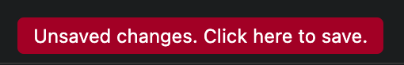

# 06 — Design System

The bar is a **professional, modern, trustworthy** scientific writing tool. Think
clean editorial software (the Untitled UI "book profile" reference the team
cited): generous whitespace, restrained color, confident typography, minimal
chrome. The reference feeling is calm and paper-like — a well-set page inside a
quiet tool, closer to iA Writer/Things than to an IDE. No decorative gradients,
no skeuomorphism; the strongest contrast in the app is reserved for manuscript
text on the editor surface. Reference inspiration lives in [`assets/`](assets/).

> This doc is the canonical design system — all visual language (color, type,
> spacing, components) lives here. The [`design/`](design/) folder extends it
> with deep UX context — ranked principles, per-surface design rules,
> interaction patterns, accessibility — start at
> [`design/README.md`](design/README.md). If the two ever disagree, this doc
> and the numbered Master Context docs win; fix the drift in the same change.

## Theme

- Modes: **System / Light / Dark**, stored in `@AppStorage("appearance")`, applied
  app-wide via `.preferredColorScheme` on every scene (main + Preferences).
- Use **semantic system colors** so both themes work automatically:
  `Color(nsColor: .textBackgroundColor)` for editor surfaces, `.windowBackgroundColor`
  for panes, `.label/.secondaryLabel/.tertiaryLabel` for text, `.bar` material for
  toolbars. Never hard-code black/white or raw hex in views — semantic colors
  only, so light and dark both look intentional, not merely inverted.

## Color & journal identity

- Accent: system accent (blue) for primary/selection. The app has exactly **one
  accent** — journal colors are identity, not accent.
- **Journal colors**: a fixed palette in order — Source = blue, then orange,
  green, purple, pink, teal (code symbol `versionColor(at:)`). A journal's
  comparison tab chip and its pane title capsule MUST share the same color; key
  the assignment to the journal (`VersionRef`), not the tab index, so closing a
  tab never recolors the surviving panes
  ([`10-performance-plan.md`](10-performance-plan.md) P3).
- Status: green = pass/ready, orange = attention, red = fail/destructive,
  secondary gray = neutral/disabled. Status color is **never the only channel** —
  always pair it with a glyph or text
  ([accessibility](design/07-interaction-patterns.md)).

## Typography

- UI text: system font (SF Pro). Titles `.headline`/`.title3`, secondary
  `.caption`/`.secondary`.
- **Editor prose**: user-configurable and shared across editors via
  `EditorTypography` — family (Sans = SF Pro [default], Serif, Mono), size
  (13–22pt, default 17), line spacing (1.0–2.5×, default 1.5). Default is **clean
  system sans**, not serif.
- **Export typography belongs to the export outline** (per-item Font · Size ·
  Spacing · Lines) — editor typography is a reading preference and never leaks
  into output.
- Monospaced (system mono) only where alignment carries meaning: SQL editors,
  data grids, filename previews.

## Layout principles

- Detail content **fills its pane**; never a shrunken, centered card. Left-align
  lists; give panes `frame(maxHeight: .infinity)`.
- Avoid stray translucent "glass" material on content surfaces — set
  `.scrollContentBackground(.hidden)` + a solid semantic background on lists.
- Master–detail uses `HSplitView`/`NavigationSplitView`; comparison panes split
  evenly with a sensible `minWidth` (~360).
- Generous padding (12–24pt); rounded corners (6–10pt); 1px hairline dividers via
  `Divider`. 4pt base grid — component spacing steps 4/8/12/16/24.
- Never double-border a region that already has a surface-color step; elevation
  only where macOS provides it (popovers, sheets) — no custom drop shadows on
  content.

## Components

- **Sidebar rows**: SF Symbol + label, count in parentheses where relevant, word
  badges on sections. Selection uses the accent highlight.
- **Comparison tab chip**: icon + journal label + ✕, filled in the journal color
  at ~15% opacity with a matching border. Give the ✕ an adequate hit area
  (≥ 20pt), not a sliver.
- **Pane title capsule**: the content item's name in the journal color
  (background ~18%, border ~55%); editable text field for body section titles.
- **Empty states**: centered icon + title + one-line hint + a prominent "Add …"
  button; the hint teaches the model in one sentence. Used by
  Authors/Figures/Tables/Bibliography/Data/Versions when empty.
- **Inline delete**: `xmark.circle.fill` in tertiary color on each removable row;
  figure thumbnails show it in the corner.
- **Forms** (Settings/Preferences/requirements): grouped `Form` with section
  headers and caption footers.
- **Check row** (Checks pane; reuse for any export preflight): state glyph,
  title, measured-vs-limit value right-aligned (`291 / 250 words`). Row identity
  must be stable across recomputes — no churn while typing.
- **Banners** (unsaved changes): full-width, tappable, one sentence with an
  implicit action; prominent without being modal.
- **Confirmation dialogs**: title states the action; body states the concrete
  consequence with numbers and names ("Overwrites NEJM's working head — v1–v3
  remain in history"); destructive button styled destructive. Never a bare
  "Are you sure?".
- **Progress**: inline/micro under 1s; determinate with honest phase names
  beyond it ("Rendering PDF · page 12/40"). The editor never blocks behind
  progress.

## Iconography

SF Symbols only, one rendering weight per surface — never mix filled and
outlined variants of the same glyph family side by side. Recurring meanings get
one symbol app-wide (document = Source, sync arrows, checkmark/✗ = check state);
the symbol alone must still disambiguate for color-blind users.

## The prose editor (most-used surface — get it right)

Top-to-bottom inside each editor pane:
1. **Colored title capsule** (in the pane chrome, from ContentView) + live word
   count on the right.
2. **Inline formatting toolbar** (`.bar` background), aligned to the text column:
   B / I / U / S / superscript / subscript │ align L/C/R/justify │ bulleted list.
   Fixed height (~36pt) — a horizontal ScrollView must be height-pinned or it
   grows and overlaps the editor.
3. **Width ruler**: tick marks + a draggable handle setting the wrap column; its
   origin aligns with the first text glyph (`EditorLayout.leftInset`).
4. **Text area**: a fixed-width wrap column (page-like) on a `.textBackgroundColor`
   surface, with a **line-number gutter** on the left numbering visual lines.

Editor metrics live in `EditorLayout` (gutter width, text inset, derived
`leftInset`) so the gutter, ruler, toolbar, and title all align to one constant.

### Visual references

**Formatting bar — target.** The editing bar should grow toward this (paragraph
style, font family, size stepper, B/I/U, text color + highlight, link, insert
comment, insert image, citation/Zotero, alignment, line spacing, checklist /
bulleted / numbered lists, indent/outdent, clear formatting). Some controls map
to other features/phases — **insert comment** → Notes (§ below); **citation
(Z)** → Zotero (Phase II plugin). Treat this as the visual/feature target, not a
literal Phase I checklist.

**Width ruler.** A horizontal scale with a draggable handle marking the wrap
column; its origin aligns to the first text glyph.

**Line-number gutter.** Numbers every visual line, right-aligned in the gutter,
vertically centered on each line; blank lines are numbered too.

## Components — additional references

- **Unsaved-changes banner.** When a journal has unsaved edits, show a prominent,
  tappable banner ("Unsaved changes. Click here to save.") that triggers Save.
  Pairs with the per-journal versioning (Save / Save new version).

  

- **Highlight-to-note.** Selecting prose surfaces a small action popover (edit /
  add comment / react); adding a comment opens a notes panel beside the content
  showing author + timestamp. See Notes in [`05-features.md`](05-features.md#h-notes--feedback-first-class).

  
  

## Tone & polish checklist (treat violations as bugs)

- Nothing floats as a translucent card on a dark/light background.
- No detail view sets its own navigation title (only the manuscript name shows).
- The "Source" comparison tab sits at the very top and never shifts down.
- Line numbers line up with their text rows; the gutter shows no stray border.
- Light and dark both look intentional — check both before declaring done.
