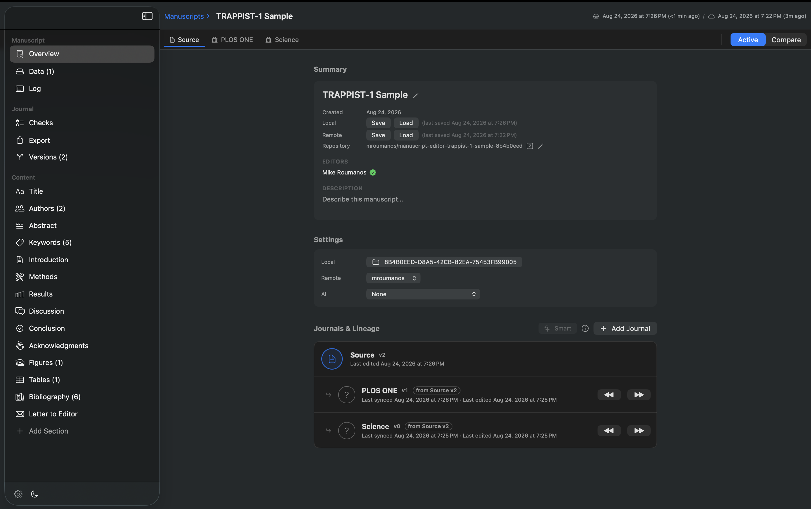
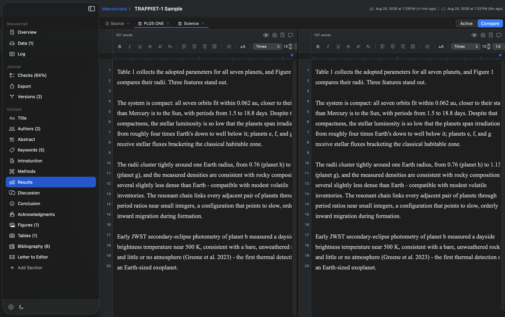
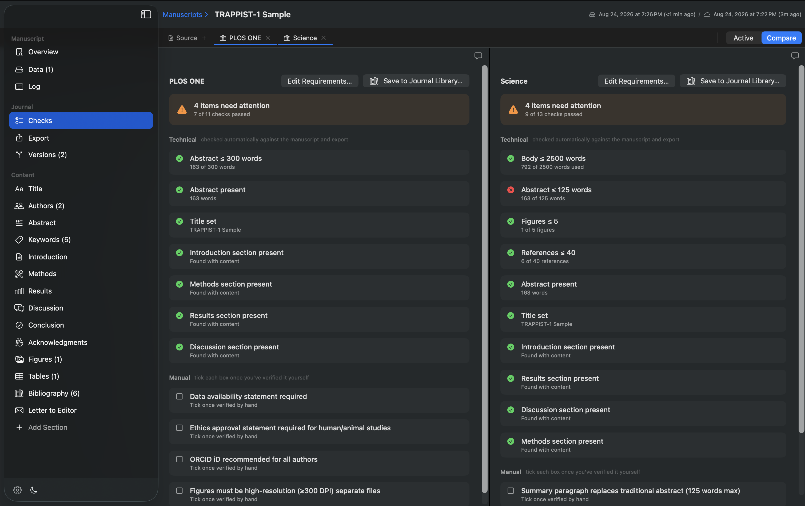
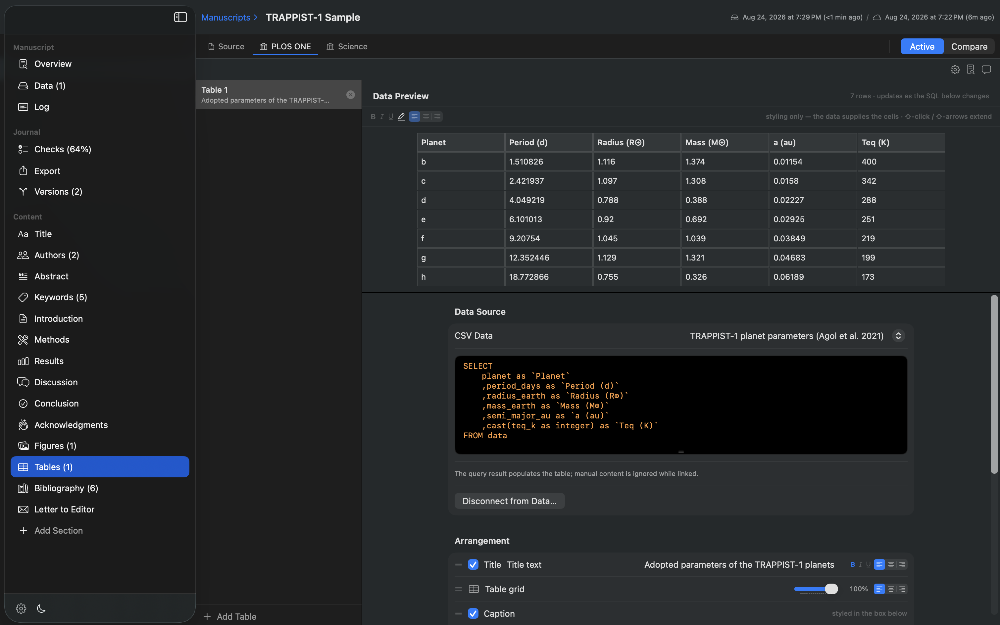
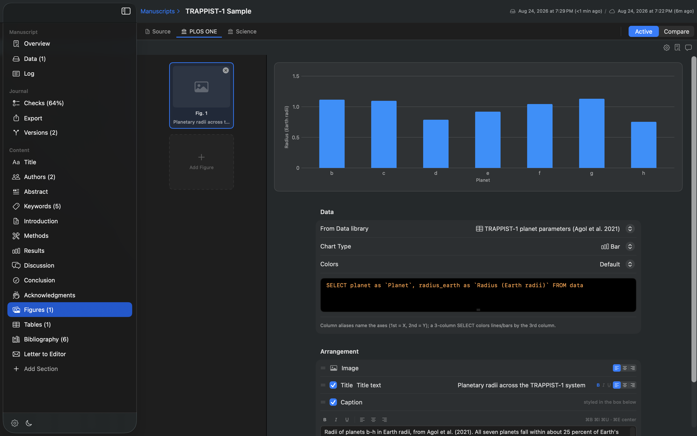
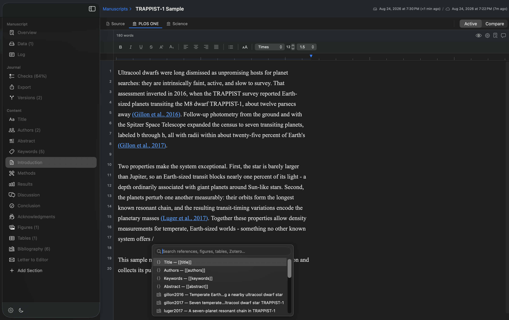
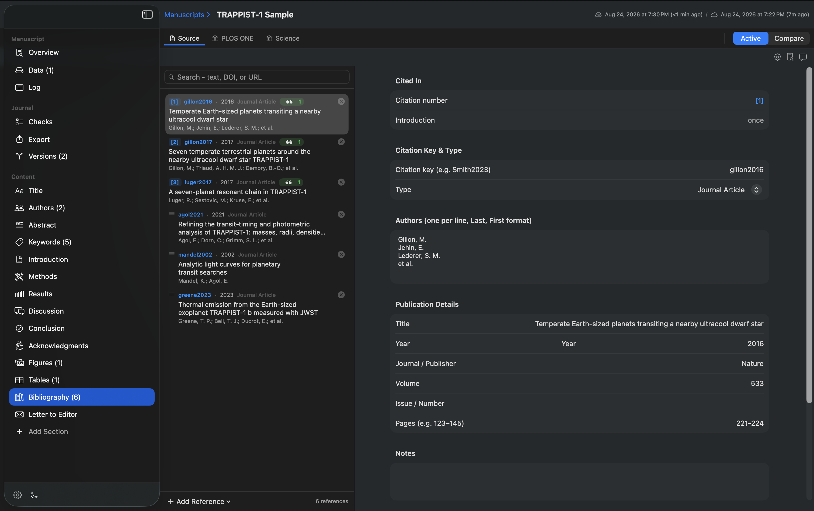
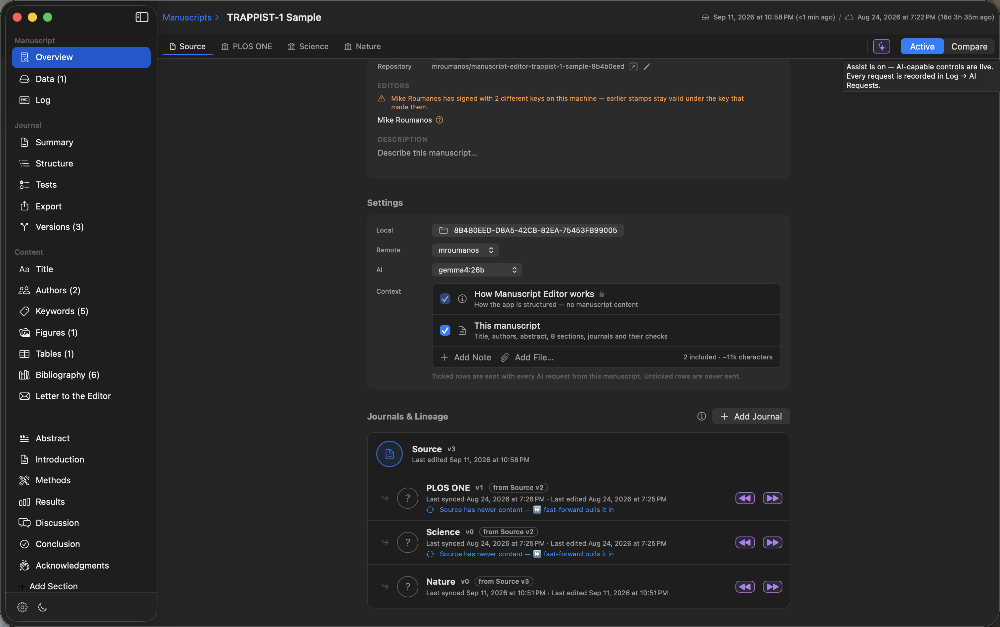
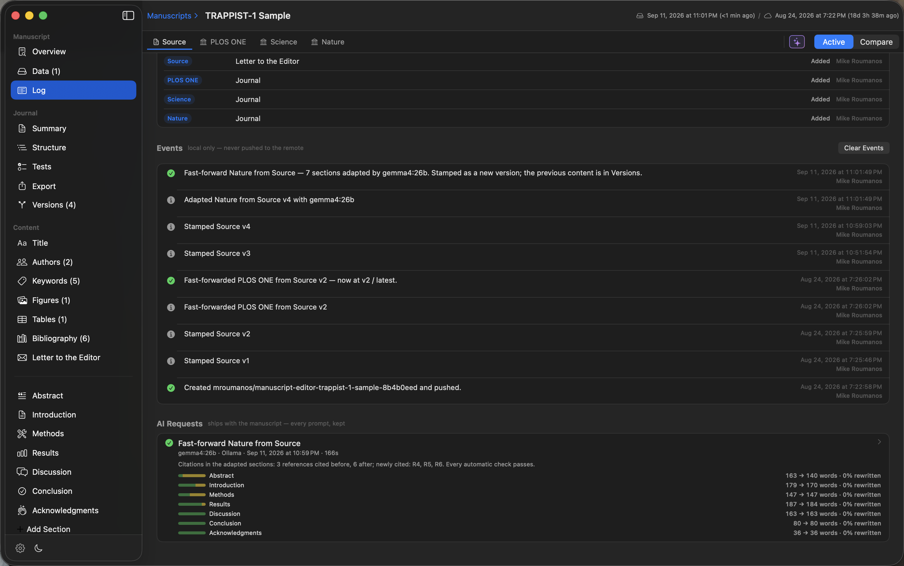
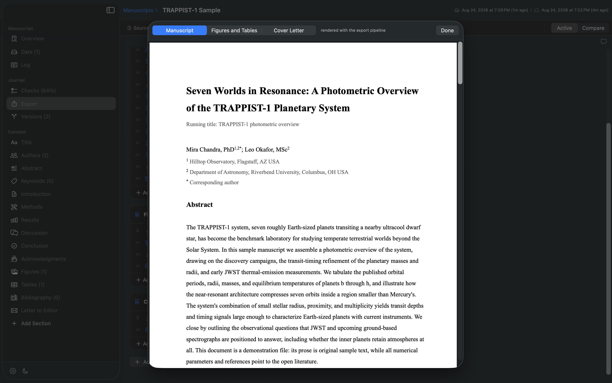

<p align="center">
  
</p>

<h1 align="center">Manuscript Editor</h1>

<p align="center">
  <b>One source manuscript, adapted to every journal.</b><br>
  A native, account-free macOS app for scientific writing.
</p>

<p align="center">
  
  
  
  
</p>

---

Scientific papers rarely go to one journal. Each submission wants its own word
limits, sections, citation style, spacing, and file format — and keeping N
copies of the same paper in sync by hand is how errors are born. Manuscript
Editor keeps **one source manuscript** and derives journal-specific **cuts**
from it: each cut re-expresses the *presentation*, never the underlying
content or data, and every cut is checked live against its journal's actual
requirements.

No account. No cloud dependency. No telemetry. A manuscript is a folder on
your disk; Git remotes and AI services are optional, bring-your-own
integrations.

## One manuscript, many journals

Every journal — including the Source — keeps its own save-point history.
Lineage edges record which version each cut derives from, with explicit
per-edge sync and rollback, locally and against an optional Git remote.

A journal is an instance of a **template** — a venue's instructions, the
sections it wants (with its own boilerplate, title-page layout and
submission questions), its tests, and its export outline. Templates are
edited in a tab of their own and travel with every manuscript that uses them.



## Compare everything side by side

Open the Source and any cuts as tabs, then compare them pane by pane — the
same section, checklist, or bibliography rendered per journal, each editable
in place. Editors display each journal's **export typography** (face, size,
spacing, line numbers), scaled by a personal display zoom that never touches
the file.



## Live submission checks

A journal's requirements become a live pass/fail checklist: word and asset
limits, required sections, export typography, reference completeness, figure
DPI, and more — plus manual checkboxes for the rules only a human can verify.
Failures that the app can repair carry a one-click Fix.



## Data lives once

Raw data (CSV → SQLite, images) is imported once into a central Data library
and *referenced* by figures and tables through SQL. A data-linked table is
populated by its query — restyle the cells (bold, highlight, alignment) while
the data supplies the values, or disconnect to a fully manual spreadsheet-style
grid. Column aliases become printed headers.



Figures work the same way: a chart is a query. Pick the chart type and
palette, and the figure re-draws live as the SQL changes — the same rendering
the export uses.



## Citations that stay live

Type `/` to cite: references, figures, tables, section tokens, and your local
Zotero library, inserted as live tokens that renumber themselves as the
manuscript changes. The bibliography tracks where each entry is cited and can
render in APA, AMA, Vancouver, MLA, Chicago, or Harvard — per journal.





## AI assist that shows its work

Bring your own model: **Claude Code** or **Codex** on the subscription you
already have, or **Ollama** for a local model that never leaves the machine.
No API keys, nothing stored. Each manuscript chooses which model it writes
with and — row by row — what that model may read.



With Assist on, a fast-forward **adapts** each section toward the target
journal: its instructions, its boilerplate, and its checks with their current
numbers. Citations travel with the claims they support (the model sees the
reference list and cites by key), manuscript fields stay as tokens, and a
reply that invents a reference or drops a field is refused — that section
keeps its previous text and the log says why. Every request is recorded in
**Log → AI Requests** with the prompt, the raw output, and a per-section
account of what changed, and the adapted content is stamped as a new version
you can roll back.



Setting it up takes a minute — see [QUICKSTART.md](QUICKSTART.md#8-ai-assist-optional).

## Export the whole package

Each journal has its own export outline — documents, sections with per-page
margins/columns/line numbers, per-component typography and captions — and
produces a complete submission package: PDF, DOCX, RTF, or LaTeX plus figure
files. The preview renders through the real export pipeline, so what you see
is what submits.



## Trying it out

New tester? **[QUICKSTART.md](QUICKSTART.md)** walks through everything in
about 15 minutes: install, GitHub token + identity setup, opening the shared
test manuscript, editing and syncing, journal cuts and comparison,
exporting, and turning on AI assist.

Compiled builds are published on the
[Releases](../../releases) page as drag-to-install `.dmg` images
(macOS 26 Tahoe or later). See [RELEASING.md](RELEASING.md) for how they are
produced. Release downloads are provided for personal evaluation only (see
License).

## Documentation

The complete product and engineering documentation lives in
[`MasterContext/`](MasterContext/) — start at its
[README](MasterContext/README.md). It covers the product vision, domain
model, architecture, feature acceptance criteria, design system, and
engineering standards.

## Building (copyright holder / authorized contributors only)

```
cd ManuscriptEditor
xcodebuild -scheme ManuscriptEditor -destination 'platform=macOS' build
```

No third-party dependencies; the project builds with Xcode alone.

## License

**All rights reserved.** This repository is source-visible for viewing only —
no reuse, copying, modification, redistribution, or incorporation into other
work (including ML training) is permitted. See [LICENSE](LICENSE).
